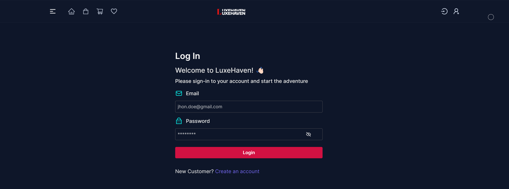
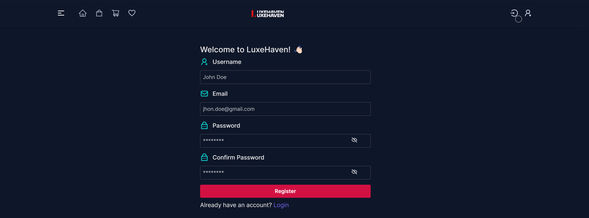
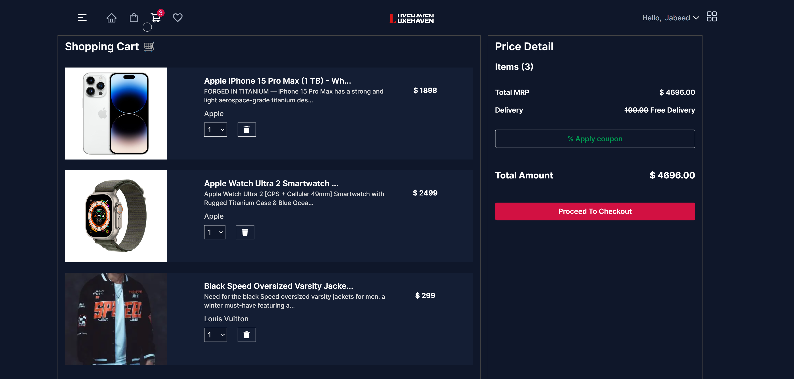
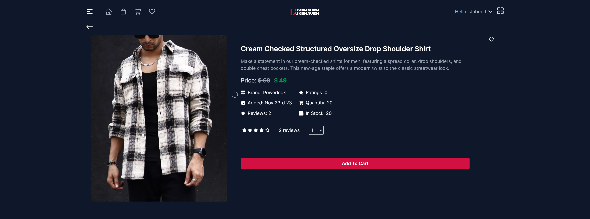
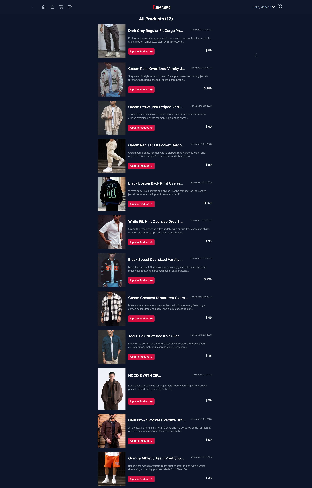
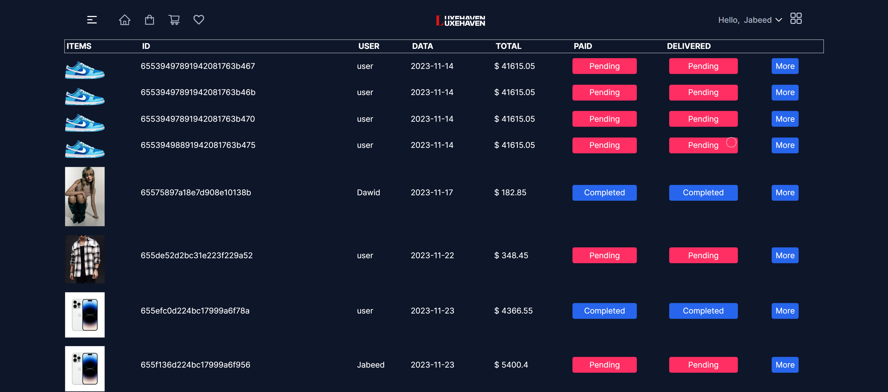

# LuxeHaven - A Modern Fullstack (MERN) E-Commerce Platform

- **LinkedIn:** [iamjabeed](https://www.linkedin.com/in/himanshurawat9/)

## Project Screenshots

**Home Page**

**Shop Page**

**Login Page**

**Register Page**

**Cart**

**Product Detailed Page**

*Scroll down for Admin related pages.*

## Overview

LuxeHaven is a top-notch MERN (MongoDB, Express, React, Node.js) E-Commerce website designed to provide a seamless shopping experience for users and efficient management tools for administrators. The platform features a stunning user interface, exceptional user experience, and a feature-rich admin dashboard.

## Key Features

### User Features

- **Authentication & Account Management:** Register via email, secure login/logout, password management.
- **Profile Management:** Edit profile details, change password, view order history, manage wishlist.
- **Shopping Experience:** Dynamic product catalog, detailed product pages with images and reviews, shopping cart
- **Search & Navigation:** Powerful search engine, advanced filtering/sorting, featured products, recently viewed items.

### Admin Features

- **Dashboard:** Real-time sales, revenue, and user activity data.
- **Product Management:** Add, edit, delete products and categories.
- **Order Management:** View, update order statuses, manage returns.
- **User Management:** View user profiles, manage roles and permissions.

## Tech Stack

- **Frontend:** React, React Router, Redux Toolkit, RTK Query, TailwindCSS.
- **Backend:** Node.js, Express, MongoDB, Mongoose, JWT for authentication, Multer for file uploads.
- **Additional Tools:** Express-Async-Handler, Cookie Parser, CORS.

## Admin Pages

**All Products**

**All Orders**

